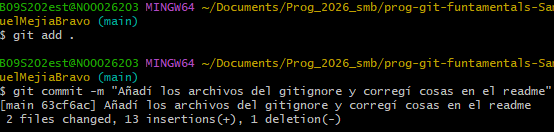
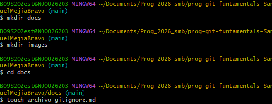
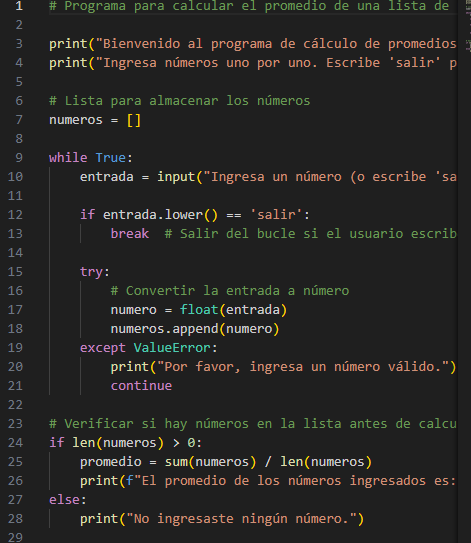

# COMANDOS PRINCIPALES
1. git config --global user.name sirve para registrar el nombre de usuario
2. git config --global user.email sirve para registrar el email del usuario
3. git init inicializa el repositorio
4. cd sirve para cambiar directorio
5. cd.. sirve para volver al anterior archivo
6. pwd muestra la ruta en la que se encuentra
7. ls lista los archivos de la carpeta, si se le añade la banderilla -al lista los archivos ocultos
8. touch sirve para crear archivos
9. mkdir para crear directorios
10. edit sirve para editar en la consola de gitbash
11. vim sirve para editar con otro visualizador de archivos
12. git status para ver el estado de commits
13. git add sirve para añadir archivos al commit
14. git commit -m "mensaje" sirve para guardar el commit
15. git remote add es para añadir la conexión remota
16. git branch -m es para cambiar la rama de trabajo
17. git remote -v es para ver si sí conectó al repositorio remoto
18. git push -u "conexión" "rama" es para enviar el commit al repositorio remoto y que quede guardado en la nube
19. git pull es para devolverse en un commit

Ejemplos:

1. 

2. 

3. 

4. 

